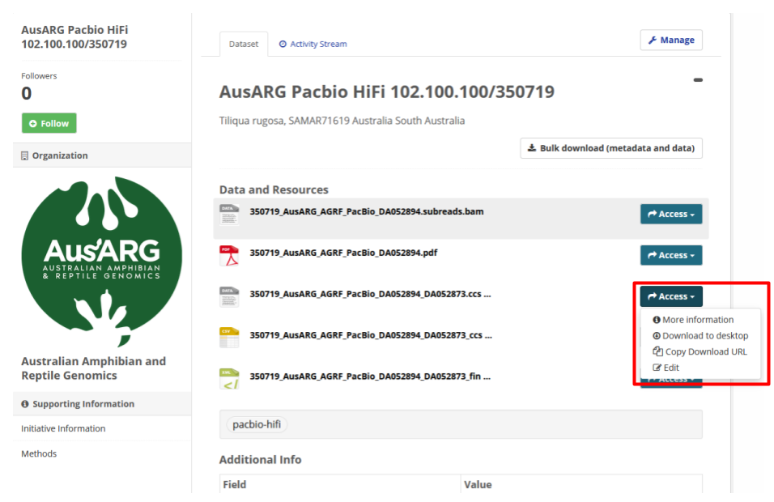
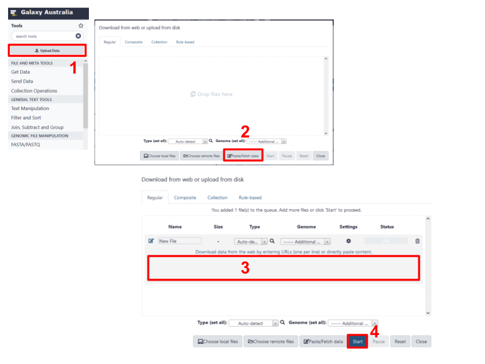

# Upload data file(s)

> FAQ: can data be seamlessly transferred from the Data Portal to Galaxy Australia?
The Australian BioCommons is working with the Bioplatforms Australia data portal team to develop a direct transfer mechanism from the portal to Galaxy Australia histories. This solution will be made available as soon as possible.

## Select your data using the Bioplatforms Data Portal
- The files you need for the assembly are ```.css.bam``` format
- Fig 1 shows a HiFi data set selected in the data portal browser interface.

## Click ```Access``` and select ```Copy Download URL``` in the drop down menu (see Fig. 1)

> Note: This will copy a download URL to your clipboard. 
> The URL is time sensitive and will expire after 10 minutes. 
> Please note you only need to instigate the download (next step) within this 10 minute window. 
> The import itself can take longer than 10 minutes.


*Fig 1.* The appearance of a HiFi data set in the Bioplatforms Australia data portal browser interface.*


## In Galaxy Australia, perform the steps outlined in Fig. 2

1. Click on ```Upload Data``` 
2. Select ```Paste/Fetch data```
3. Paste the URL you obtained from the data portal into the content box.
4. Select ```Start```

> Note: you can paste multiple URLs in this box. If you have more than 1 SMRT cell of data, you will need to copy the URLs for each of the ```ccs.bam``` files and paste them in here.


*Fig 2. Process required for download of data based on a URL provided to Galaxy Australia.*

## Other options are also available

### Self-managed (download & upload)

1. [Download](https://usersupport.bioplatforms.com/programmatic_access.html) required HiFi data to your personal computer, then
2. Upload / transfer to Galaxy Australia (see **Fig 3**)
     - Note: the following Galaxy Training Network tutorial provides guidance on [how to upload files via URL](https://training.galaxyproject.org/training-material/topics/introduction/tutorials/galaxy-intro-short/tutorial.html#upload-a-file). The same mechanism can be used to upload local files, by selecting ```Choose local files``` (see **Fig 3**).


*Fig 3. Choosing local files to upload to Galaxy Australia.*

### Self-managed (Cloudstor mediated)

1. Upload / transfer data to Cloudstor (see [Getting Started Guide](https://support.aarnet.edu.au/hc/en-us/articles/227469547-CloudStor-Getting-Started-Guide)), then
2. Upload / transfer to Galaxy Australia (see ```Import from CloudStor``` tool in Galaxy Australia)

### Supported

- Contact the [Galaxy Australia Support team](mailto:help@genome.edu.au) for data chaperoning
